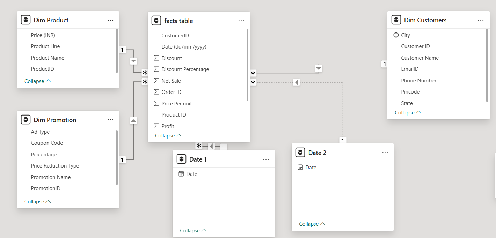
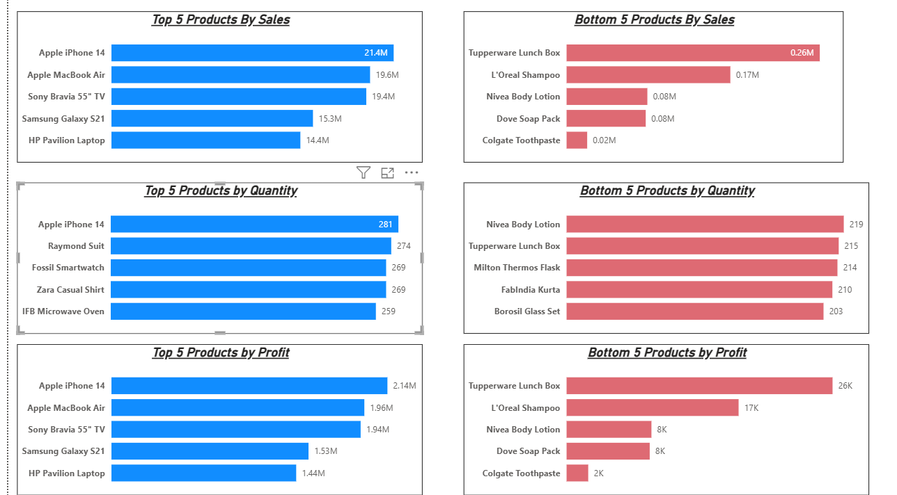
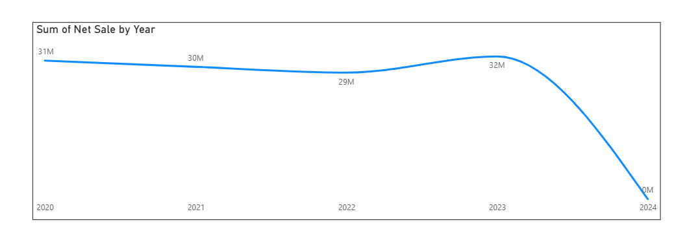
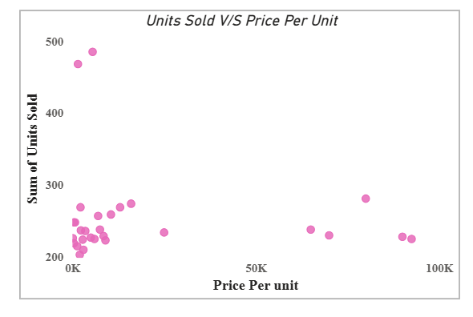
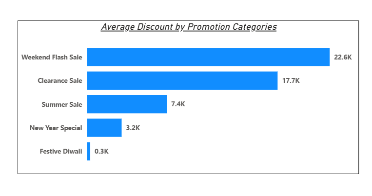
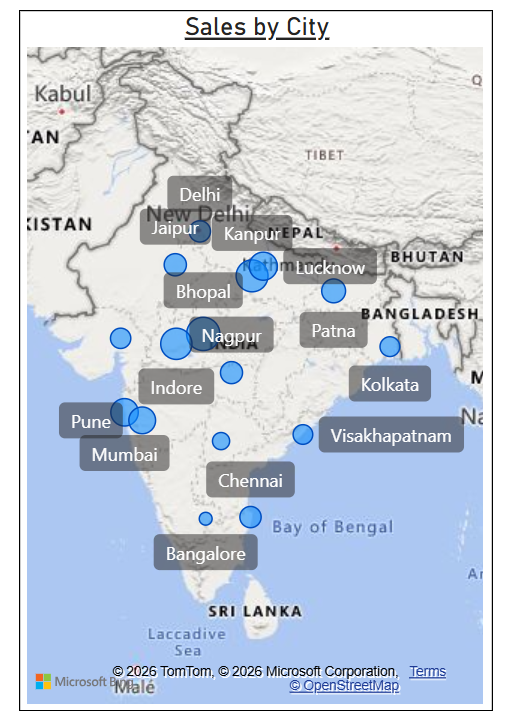
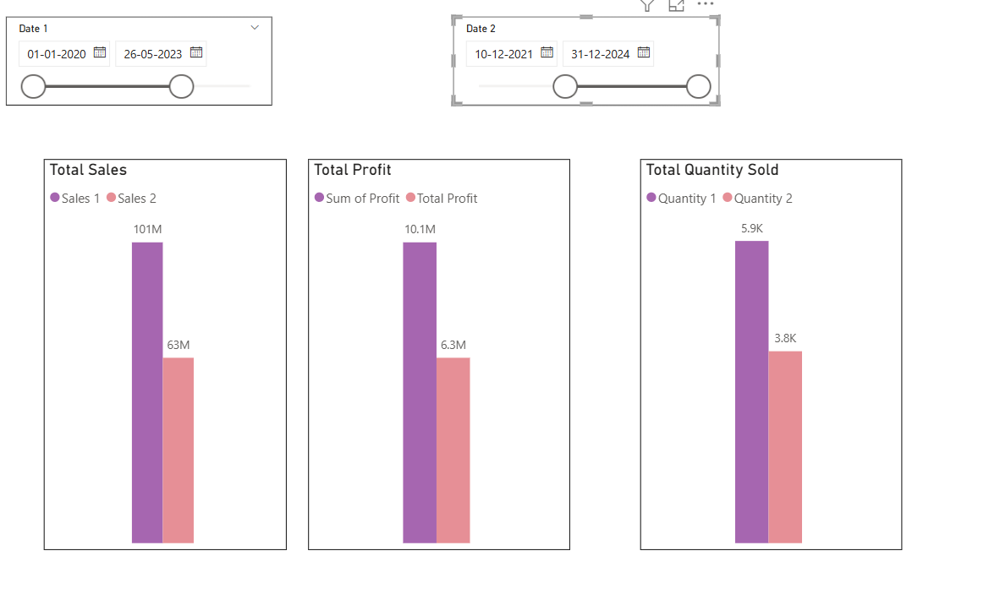
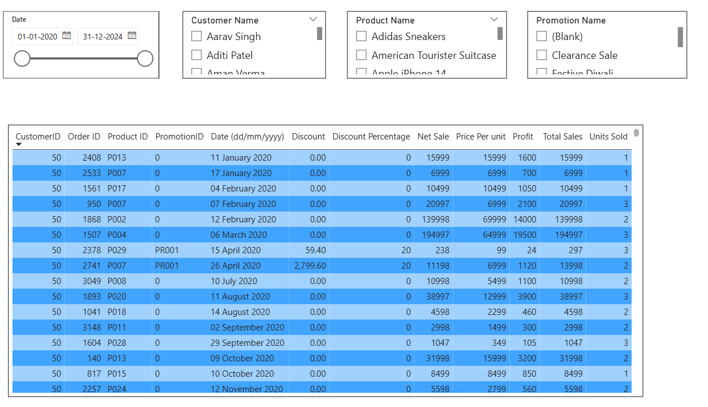

# 📊 ElectroHub Sales Analytics Dashboard | Power BI

An end-to-end Power BI dashboard built for **ElectroHub**, a multi-category retail brand (Electronics, Footwear, Clothing, Home Appliances, Accessories, Kitchenware, Bags, Personal Care), analyzing **3,500+ orders** across 51 customers, 31 products, and 6 promotional campaigns.

The project moves from raw Excel data to a fully interactive, decision-ready dashboard — covering data cleaning, dimensional modeling, DAX, and dynamic reporting features that go beyond static charts.

---

## 🧰 Tools Used

`Power BI Desktop` · `Power Query` · `DAX` · `Excel` (source data)

---

## 🧹 Data Preparation

- Loaded raw sales data from Excel into Power BI
- Ran full-dataset **column profiling** (Column Quality, Column Distribution, Column Profile) to catch data quality issues early
- Identified columns with fully missing values and resolved them via **left-join merges** with related lookup tables
- Cleaned and shaped data in Power Query before loading into the model

---

## ⭐ Data Model — Star Schema

| Table | Type | Key Fields |
|---|---|---|
| **Fact Table** | Fact | CustomerID, ProductID, PromotionID, Date, Units Sold, Net Sales, Discount |
| **Dim Customers** | Dimension | Name, City, State, Pincode, Contact |
| **Dim Product** | Dimension | Product Name, Product Line, Price |
| **Dim Promotion** | Dimension | Promotion Name, Ad Type, Coupon Code |

All dimension tables connect to the Fact table via **1-to-many relationships** with single-direction cross-filtering — reducing data redundancy and keeping the model fast and clean.



---

## ✅ Business Requirements Solved

| # | Requirement | Solution |
|---|---|---|
| 1 | Top/Bottom 5 products by Sales, Profit, Quantity Sold | Six ranked bar charts (Top 5 + Bottom 5 per metric) |
| 2 | How sales trends vary over time | Year-over-year line chart of Net Sales (2020–2024) |
| 3 | Relationship between Sales & Profit | Scatter plot analysis |
| 4 | Compare Sales/Profit/Quantity between any two user-selected periods | Dynamic dual date-slicer comparison |
| 5 | Average discount offered per promotion category | Sorted bar chart across 6 campaign types |
| 6 | Total number of orders | KPI card (3,510 orders) |
| 7 | Full order-level detail, filterable by Product/Date/Customer/Promotion | Drill-down table with 4 interactive slicers |
| 8 | Sales by different cities | Bubble map across Indian cities |

---

## 📈 Dashboard Highlights

### Top & Bottom 5 Performers
Ranked views across Sales, Quantity, and Profit — flags best and worst-performing products instantly.



### Sales Trend Over Time
Tracks Net Sales year-over-year, surfacing growth periods and a notable shift in the most recent year.



### Units Sold vs. Price Per Unit
Reveals price sensitivity: lower-priced products drive significantly higher volumes, while premium-priced items sell in smaller, steadier volumes.



### Average Discount by Promotion Category
Weekend Flash Sale and Clearance Sale carry the deepest average discounts; festival campaigns like Diwali lean less on price cuts.



### Sales by City
Geographic view highlighting Nagpur, Pune, and the Delhi-NCR cluster as top-performing regions.



### Dynamic Two-Period Comparison
Users pick any two custom date ranges and instantly compare Total Sales, Profit, and Quantity side-by-side. Implemented using **Edit Interactions** for a lightweight, efficient result — after first prototyping the same feature with dual date tables and `USERELATIONSHIP` DAX measures, then simplifying once the added model complexity wasn't justified for this use case.

```dax
Total Profit = 
CALCULATE(
    SUM('facts table'[Profit]),
    ALL('Date 1'[Date]),
    USERELATIONSHIP('Date 2'[Date], 'facts table'[Date (dd/mm/yyyy)])
)
```



### Order-Level Detail Table
Fully filterable drill-down (Date, Customer, Product, Promotion) exposing every field per order — supports ad-hoc questions beyond the summary dashboard.



### Dynamic Cross-Slicer Filtering
Measure-based slicer filtering ensures selecting a value in one slicer narrows others to only relevant, non-empty combinations — preventing dead-end filter selections.

```dax
Sum Dim = SUM('facts table'[Net Sale])
```

---

## 🔑 Key Insights

- **Price sensitivity is strongest in the mass-market segment** — lower-priced products consistently outsell premium items in volume.
- **Promotional strategy varies by campaign type** — Weekend Flash Sale and Clearance Sale rely on deep discounts, while festival campaigns appear more brand/urgency-driven.
- **Nagpur, Pune, and Delhi-NCR** lead in regional sales performance.
- **Top performers are consistent across metrics** — the same products lead in revenue, volume, and profit alike.

---

## 🛠️ Skills Demonstrated

`Data Cleaning & Profiling` · `Power Query (ETL)` · `Star Schema Data Modeling` · `DAX (CALCULATE, USERELATIONSHIP, ALL)` · `Dynamic Filtering` · `Data Visualization` · `Business Insight Generation`

---

## 📁 Repository Contents

```
├── README.md
├── ElectroHub_Sales_Dashboard.pbix
├── Store_Data.xlsx
└── screenshots/
    ├── data_model.png
    ├── top_bottom_5.png
    ├── sales_trend.png
    ├── scatter_price_vs_units.png
    ├── discount_by_category.png
    ├── sales_by_city.png
    ├── period_comparison.png
    └── order_detail_table.png
```

---

## 📬 Contact

**Aamir Qadir Sofi**
[LinkedIn](https://linkedin.com/in/aamir-qadir-sofi-27908728b) · [GitHub](https://github.com/AAMIRQADIR-79)
